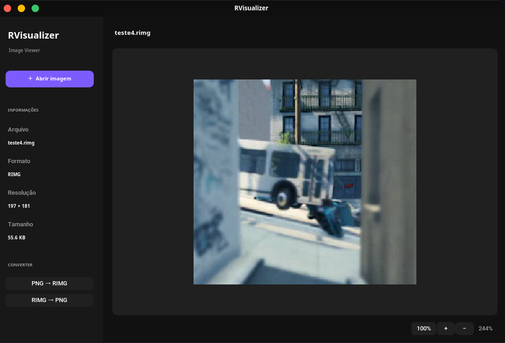

# RIMG
RIMG is a png-like image format with almost the same size as .png, no purpose at all.

# RVisualizer
RVisualizer is a image visualizer that supports RIMG, made so you can visualize RIMG

# Screenshots



# Installation

```bash
curl -fsSL https://raw.githubusercontent.com/batata123muitoboa-dot/RIMG/main/install.sh | bash
